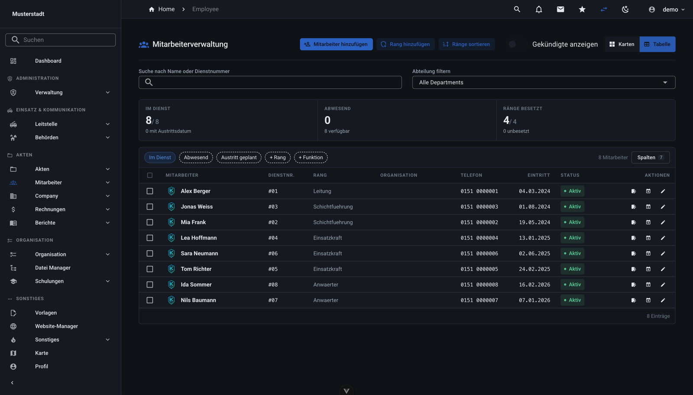
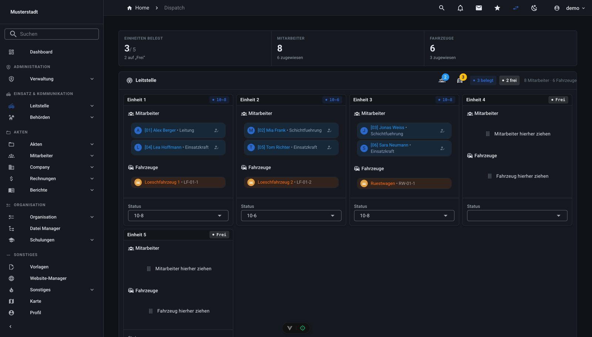
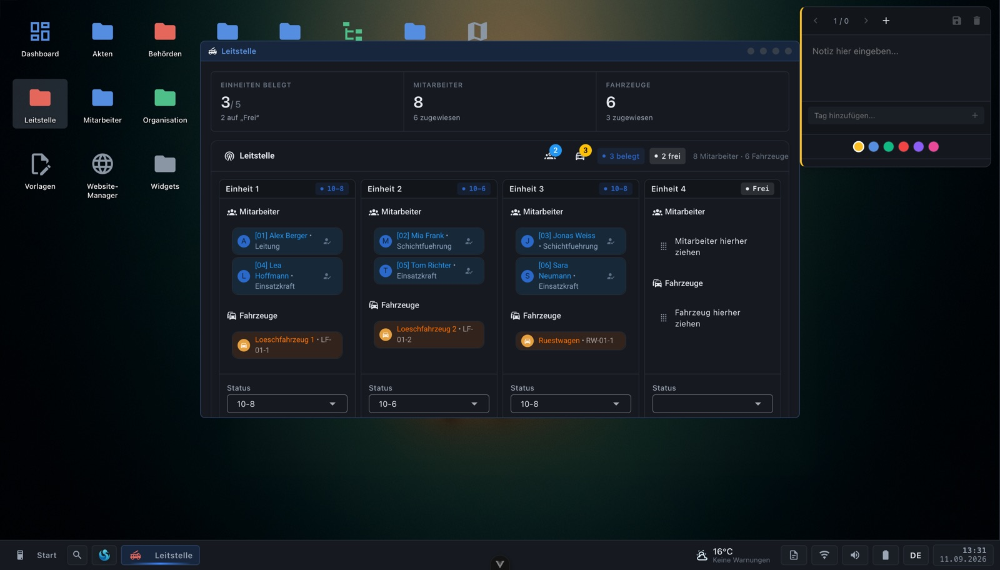
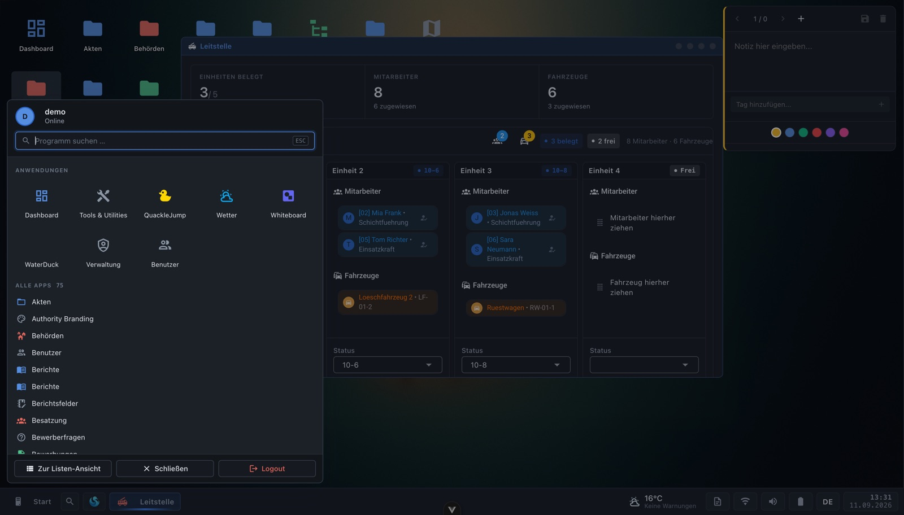
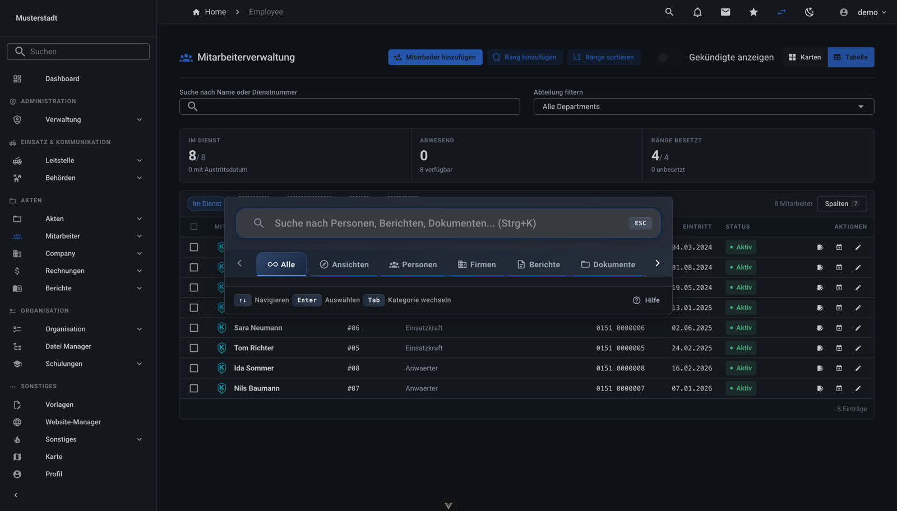
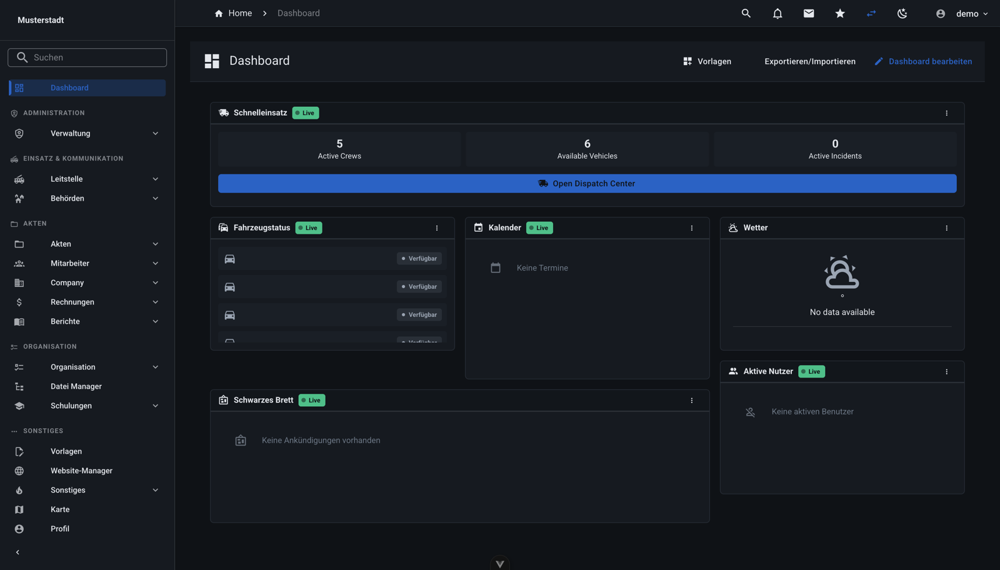
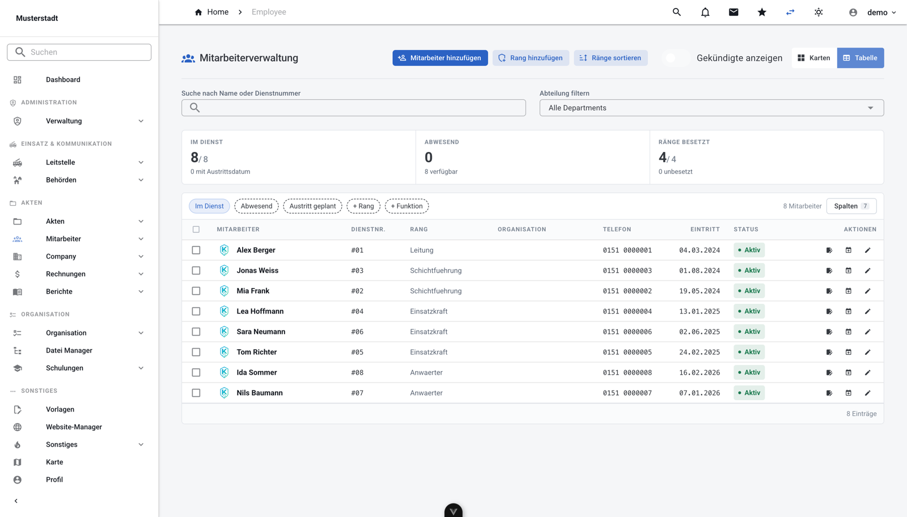
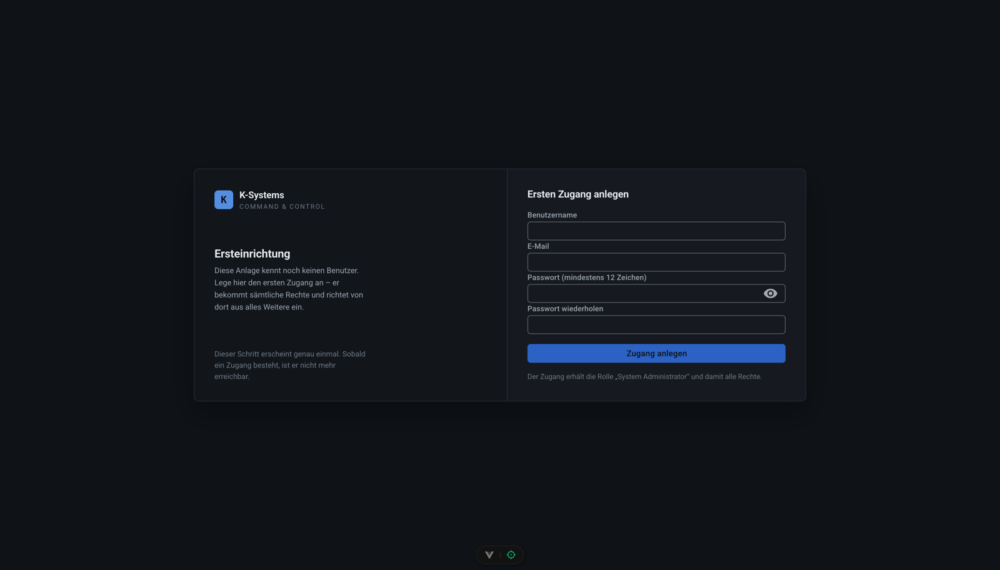

<div align="center">

# K-Systems

### Multi-Tenant Enterprise Management Platform with Desktop Interface

[](LICENSE)
[](https://ko-fi.com/kyuubiddragon)
[](https://dsc.gg/kyuubisoft)


---

**[Einblick](#einblick--a-look-inside)** | **[Deutsch](#deutsch)** | **[English](#english)** | **[Quick Start](#quick-start)** | **[Documentation](docs/)**

</div>

---

## Einblick / A look inside

Alle Aufnahmen stammen aus einer frisch aufgesetzten Anlage mit Beispieldaten.
*All screenshots are from a freshly installed instance with sample data.*

### Arbeitsbereich — Listen, Kennzahlen, Filter



Kennzahlen über der Liste, Filter als Schalter mit Inhalt statt bloßer Zähler,
frei wählbare Spalten, Auswahlspalte für Sammelaktionen. Bedeutung steht links,
Zahlen rechts und in Festbreite, damit sie untereinander vergleichbar bleiben.

### Leitstelle — Einheiten, Besatzung, Fahrzeuge



Belegte und freie Einheiten im Kopf, jede Einheit mit Statusmarke. Mitarbeiter
und Fahrzeuge werden per Ziehen zugewiesen.

### Fenster-Modus — der zweite Rahmen



Dieselben Tokens wie die Seitenleisten-Ansicht, nur ein anderer Rahmen: frei
anordbare Fenster, Taskleiste, Startmenü, Widgets auf der Arbeitsfläche. Das
aktive Fenster erkennt man an der Titelleiste.

<table>
<tr>
<td width="50%"><br><sub><b>Startmenü</b> — Suche, Kacheln, vollständige Programmliste</sub></td>
<td width="50%"><br><sub><b>Befehlspalette</b> (Strg+K) — Personen, Berichte, Dokumente, Ansichten</sub></td>
</tr>
<tr>
<td width="50%"><br><sub><b>Dashboard</b> — Bausteine aus sechs Vorlagen, frei anordbar</sub></td>
<td width="50%"><br><sub><b>Heller Modus</b> — dieselbe Ansicht, umgeschaltet</sub></td>
</tr>
</table>

### Ersteinrichtung



Die Datenbank wird ohne Benutzerkonto ausgeliefert. Beim ersten Start öffnet
die Anwendung diesen Schritt; der dort angelegte Zugang bekommt sämtliche
Rechte. Sobald ein Konto besteht, ist der Schritt nicht mehr erreichbar.

---

## English

K-Systems is a comprehensive, multi-tenant enterprise management platform featuring a unique Windows-style desktop interface. Manage employees, documents, reports, invoices, dispatch operations, and much more - all within a modern, real-time web application.

### Features

Grouped the way the navigation is. Every module can be switched on or off per
authority.

| Group | What it covers |
|-------|----------------|
| **Dispatch & Communication** | Dispatch centre with units, crew and vehicle assignment by drag and drop, status codes; blackboard; authority directory; internal messaging and mail with real-time sync |
| **Records** | Employee management (ranks, departments, licences, training, absences), person files, vehicle files, apartment files, companies, invoices with line items, reports with templates, custom fields and status workflows, document areas with versioning |
| **Organisation** | Organisation chart, file manager, training and tests, calendar with recurring events, applications with custom forms, shift planning, vacation calendar |
| **Administration** | Users, roles and 204 fine-grained permissions, authority branding, feature switches, global settings, module and report configuration |
| **Other** | Templates, website builder for authorities, Leaflet map with custom markers and categories, to-do lists, collaborative whiteboard, weather, small games |
| **Dashboard** | Six role templates (dispatcher, HR, reports, member, employee, admin) built from 19 widgets, freely arrangeable, saved per user |
| **Two layouts** | Sidebar for focused work, window mode with draggable windows, taskbar, start menu and desktop widgets — same tokens, same density, only a different frame |
| **Command palette** | Ctrl+K searches people, reports, documents, vehicles, views and more, with recently used items on top |
| **Multi-tenant** | Full data isolation per authority, own branding, own feature set, own settings |
| **First-run setup** | The database ships without an account; the first one created receives every permission |
| **Bilingual** | German and English throughout, including dates, numbers and currency |
| **Light and dark** | Both modes are first-class, driven by one token set |

### Tech Stack

| Component | Technology |
|-----------|------------|
| **Frontend** | Vue 3, TypeScript, Vuetify 3, Pinia, Vue Router |
| **Backend** | PHP 8.1+, JWT Authentication, REST API (50+ modules) |
| **Socket Server** | Node.js, Socket.io, Express |
| **Database** | MariaDB / MySQL, 149 tables, shipped as a ready baseline |
| **Infrastructure** | Docker, Traefik, Nginx/Apache |

---

## Deutsch

K-Systems ist eine umfassende, mandantenfähige Enterprise-Management-Plattform mit einer einzigartigen Windows-ähnlichen Desktop-Oberfläche. Verwalte Mitarbeiter, Dokumente, Berichte, Rechnungen, Einsätze und vieles mehr - alles in einer modernen Echtzeit-Webanwendung.

### Funktionen

Gegliedert wie die Navigation. Jedes Modul lässt sich je Behörde ein- und
ausschalten.

| Bereich | Was dazugehört |
|---------|----------------|
| **Einsatz & Kommunikation** | Leitstelle mit Einheiten, Besatzung und Fahrzeugen per Ziehen zuweisen, Statuscodes; Schwarzes Brett; Behördenverzeichnis; internes Messaging und Mailsystem mit Echtzeit-Abgleich |
| **Akten** | Mitarbeiterverwaltung (Ränge, Abteilungen, Lizenzen, Schulungen, Abwesenheiten), Personen-, Fahrzeug- und Wohnungsakten, Firmen, Rechnungen mit Positionen, Berichte mit Vorlagen, eigenen Feldern und Statusabläufen, Dokumentbereiche mit Versionierung |
| **Organisation** | Organigramm, Dateimanager, Schulungen und Tests, Kalender mit Wiederholungen, Bewerbungen mit eigenen Formularen, Schichtplanung, Urlaubskalender |
| **Verwaltung** | Benutzer, Rollen und 204 einzelne Rechte, Behörden-Branding, Modulschalter, Grundeinstellungen, Berichts- und Modulkonfiguration |
| **Sonstiges** | Vorlagen, Website-Baukasten für Behörden, Leaflet-Karte mit eigenen Markern und Kategorien, Aufgabenlisten, gemeinsames Whiteboard, Wetter, kleine Spiele |
| **Dashboard** | Sechs Rollenvorlagen (Leitstelle, Personal, Berichte, Mitglied, Mitarbeiter, Verwaltung) aus 19 Bausteinen, frei anordbar, je Benutzer gespeichert |
| **Zwei Layouts** | Seitenleiste für konzentriertes Arbeiten, Fenster-Modus mit frei anordbaren Fenstern, Taskleiste, Startmenü und Widgets — dieselben Tokens, dieselbe Dichte, nur ein anderer Rahmen |
| **Befehlspalette** | Strg+K durchsucht Personen, Berichte, Dokumente, Fahrzeuge, Ansichten und mehr, zuletzt Benutztes zuoberst |
| **Mandantenfähig** | Vollständig getrennte Daten je Behörde, eigenes Branding, eigener Modulumfang, eigene Einstellungen |
| **Ersteinrichtung** | Die Datenbank wird ohne Konto ausgeliefert; das erste angelegte bekommt sämtliche Rechte |
| **Zweisprachig** | Deutsch und Englisch durchgehend, samt Datum, Zahlen und Beträgen |
| **Hell und dunkel** | Beide Modi gleichrangig, aus einem Satz Merker gespeist |

---

## Quick Start

### Docker - Local Development

```bash
# 1. Clone the repository
git clone https://github.com/KyuubiDDragon/K-Systems.git
cd K-Systems

# 2. Start all services (no configuration needed!)
docker-compose -f docker-compose.dev.yml up -d

# 3. Access
# Frontend:      http://localhost:5173
# Backend API:   http://localhost:8080
# Socket Server: http://localhost:3001
# First start: the app opens /setup and asks for the first account
```

### Docker - Production (with Traefik)

The main `docker-compose.yml` is configured for production with [Traefik](https://traefik.io/) as reverse proxy with automatic HTTPS.

```bash
# 1. Create .env at project root with your settings
cp backend/.env.template .env
# Edit .env: set DOMAIN, DB_PASSWORD, JWT_SECRET_KEY, SOCKET_API_KEY, etc.

# 2. Make sure Traefik is running and the 'web' network exists
docker network create web  # if not already created

# 3. Start all services
docker-compose up -d
```

See [Deployment Guide](DEPLOY_README.md) for detailed production setup.

### Manual Setup (without Docker)

**Requirements:**
- PHP 8.1+ (with extensions: pdo_mysql, mbstring, json, gd, zip)
- MariaDB 10.5+ / MySQL 8.0+
- Node.js 18+
- Composer

```bash
# Backend
cd backend
composer install
cp .env.template .env  # Configure your .env

# Frontend
cd frontend
npm install
npm run dev    # Development (port 5173)
npm run build  # Production

# Socket Server
cd socket-server
npm install
npm run dev  # Development (port 3001)

# Database
mysql -u root -p -e "CREATE DATABASE ksystems CHARACTER SET utf8mb4 COLLATE utf8mb4_unicode_ci;"
mysql -u root -p ksystems < database/database.sql
```

### First-time setup

The database ships **without any user account**. On first start the application
opens a setup screen at `/setup`:

| Field | Notes |
|-------|-------|
| **Username** | free choice |
| **Email** | must be a valid address |
| **Password** | at least 12 characters |

The account created there receives the `System Administrator` role and with it
every permission, so it can configure the rest of the system. The setup screen
is reachable only while no user exists — once one does, it refuses.

> Earlier versions shipped a fixed `admin` / `password` account. Every
> installation would have been open with the same publicly known credentials,
> so it is gone.

---

## Architecture

```
K-Systems/
├── frontend/          # Vue 3 + TypeScript + Vuetify 3
│   ├── src/views/     # Feature-based views
│   ├── src/components/# Reusable components
│   ├── src/stores/    # Pinia state management
│   ├── src/api.ts     # Centralized API client
│   └── src/locales/   # i18n translations (en, de)
├── backend/           # PHP 8.1 REST API
│   ├── [module]/      # Each module: index.php (CRUD)
│   ├── auth_check.php # JWT authentication
│   ├── jwt.php        # Token creation/validation
│   └── bootstrap.php  # App initialization
├── socket-server/     # Node.js real-time server
│   ├── server.js      # Socket.io server
│   └── modules/       # Chat, notifications, status, mail
├── database/          # Database schema
│   └── database.sql   # Full schema + seed data
├── docs/              # Documentation (VitePress)
└── docker-compose.yml # Docker orchestration
```

### Multi-Tenant Architecture

Every table includes `authority_id` for complete data isolation between organizations. Each tenant gets their own:
- Custom branding (logo, colors, site name)
- Feature flags (enable/disable modules)
- Role & permission configuration
- Isolated data storage

---

## Environment Variables

### Required

| Variable | Description |
|----------|-------------|
| `DOMAIN` | Your public domain (e.g., `ksystems.example.com`) - production only |
| `DB_DATABASE` | Database name (default: `ksystems`) |
| `DB_USERNAME` | Database user (default: `ksystems`) |
| `DB_PASSWORD` | Database password |
| `DB_ROOT_PASSWORD` | MariaDB root password (used in docker-compose) |
| `JWT_SECRET_KEY` | Secret key for JWT signing (min. 32 characters) |
| `SOCKET_API_KEY` | API key for backend ↔ socket server communication |
| `CADDY_DOMAIN` | Public domain for frontend build (same as DOMAIN) |

### Optional

| Variable | Default | Description |
|----------|---------|-------------|
| `APP_ENV` | `production` | Environment (`production`, `development`) |
| `JWT_EXPIRATION_TIME` | `3600` | Token lifetime in seconds |
| `COOKIE_SECURE` | `true` | Secure cookies (requires HTTPS) |
| `COOKIE_SAMESITE` | `Lax` | SameSite cookie policy |

See [`backend/.env.template`](backend/.env.template) for all options.

---

## System Requirements

### Minimum
- **CPU:** 2 cores
- **RAM:** 2 GB
- **Disk:** 10 GB
- **OS:** Ubuntu 20.04+, Debian 11+, or Docker-compatible

### Recommended (Production)
- **CPU:** 4+ cores
- **RAM:** 8 GB
- **Disk:** 50 GB SSD
- **OS:** Ubuntu 22.04 LTS

---

## Documentation

- **[Deployment Guide](DEPLOY_README.md)** - Production deployment
- **[Docker Guide](DOCKER-README.md)** - Docker setup
- **[API Documentation](docs/api/)** - REST API reference
- **[Architecture](docs/architecture/)** - System architecture
- **[User Guides](docs/guide/)** - Feature documentation

---

## Security

- JWT token authentication with refresh tokens
- Password hashing (bcrypt)
- SQL injection protection (prepared statements)
- XSS protection (CSP headers)
- Input validation and sanitization
- File upload type validation
- Authority-based access control (multi-tenant isolation)
- Session management with device tracking

---

## Contributing

Contributions are welcome! Please:

1. Fork the repository
2. Create your feature branch (`git checkout -b feature/amazing-feature`)
3. Commit your changes (`git commit -m 'Add amazing feature'`)
4. Push to the branch (`git push origin feature/amazing-feature`)
5. Open a Pull Request

Make sure to:
- Update both EN and DE translations when adding features
- Include `authority_id` in all database queries (multi-tenant!)
- Check permissions in both frontend and backend
- Test with multiple authorities

---

## License

This project is licensed under the MIT License - see the [LICENSE](LICENSE) file for details.

---

<div align="center">

## Support

If you find this project helpful, consider supporting me!

[](https://ko-fi.com/kyuubiddragon)
[](https://dsc.gg/kyuubisoft)

**Discord Support Server:** [dsc.gg/kyuubisoft](https://dsc.gg/kyuubisoft)

---

K-Systems - Made with :heart: by [KyuubiDDragon](https://github.com/KyuubiDDragon)

</div>
